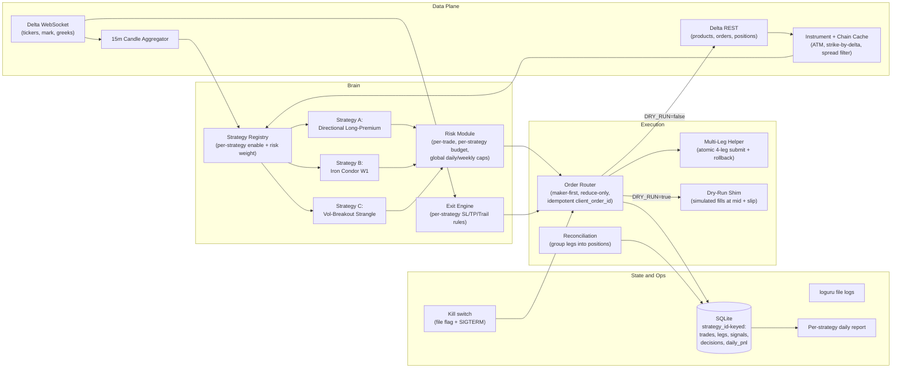
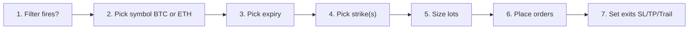
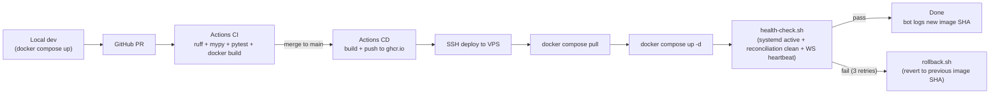

# Delta India Options Bot v1 - Implementation Plan

## Context (verified facts, not assumptions)

- Venue: Delta Exchange India, European BTC/ETH options.
- Expiries available: D1, D2, W1, W2, W3, all settling 5:30 PM IST via 30-min TWAP of index.
- Lot sizes: BTC 0.001, ETH 0.01. Tickers API exposes Greeks (delta/gamma/theta/vega/rho).
- Fees: maker 0.010 percent, taker 0.03 percent, capped at 3.5 percent of premium, plus 18 percent GST.
- Margin: USD-INR fixed on platform, so 50,000 INR at 85 = **588 USD effective book**.
- Rate limits: REST 100/10s, orders 50/10s, WS 20/s. Official SDK: `delta-rest-client` (PyPI).
- Stack chosen: Python 3.11+. Hosting chosen: cheap Linux VPS (systemd, SQLite, file logs).

## Shape decision (the top-level fork)

Two genuinely different system shapes were considered before locking the strategies:

### Shape 1 - Single-strategy v1 (deferred)
- **Summary:** Build one workhorse strategy (directional long-premium), defer iron condor and strangle to v2.
- **Assumption that makes it work:** A single strategy can hit enough trades in 2-3 weeks to be confidently promoted, and you're willing to wait months for additional strategies.
- **Assumption that breaks it:** You want to evaluate theta-positive and direction-agnostic plays sooner than v2 can deliver.
- **Reversibility cost:** **High.** Trivial to extend later, but adds 6-10 weeks calendar time before iron condor goes live.
- **Effort:** ~2 wk build + 2-3 wk dry run.

### Shape 2 - Multi-strategy v1 (CHOSEN)
- **Summary:** One execution stack, one risk module, one decision log; three pluggable strategies (directional, iron condor, vol-breakout strangle) running in parallel during dry-run with independent risk budgets and independent go-live gates.
- **Assumption that makes it work:** The strategies are loosely coupled - they share infra but make independent decisions - and the iron condor's low trade count is acceptable because directional carries the validation load while condor accumulates evidence for a later go-live.
- **Assumption that breaks it:** Multi-leg execution on Delta India turns out to be unreliable at retail rate limits, forcing condor to be cut. Mitigation: condor is feature-flagged and can be disabled without touching the other two.
- **Reversibility cost:** **Medium.** A strategy can be disabled by config (`enabled: false`), but removing the `Strategy` interface itself once it has 3 consumers is a rewrite. Acceptable price.
- **Effort:** ~2.5-3 wk build + 2-3 wk dry run + condor's own delayed go-live ~4-6 wk later.

## Recommended approach: Shape 2 (Multi-strategy v1)

It dominates Shape 1 on **calendar time to having all three strategies operational**, costs only ~5-7 extra build days, and turns each subsequent strategy into a 1-PR addition instead of a fork in v2. The directional strategy still carries the 2-3 week validation load (20-40 trades), so the original constraint is unaffected.

The three strategy modules baked in from day one:

### Strategy A - Directional long-premium on short-DTE (primary)
- **Summary:** Buy ATM/+1 OTM D1/D2 calls or puts on trend + ATR breakout signal.
- **Assumption that makes it work:** Crypto produces enough intraday directional bursts to beat theta when entries are filtered.
- **Assumption that breaks it:** Regime turns chop-dominated; theta bleed exceeds delta gains for the entire dry-run window.
- **Reversibility cost:** **High.** Max loss per trade = premium paid. No margin entanglement.
- **Risk-budget weight:** 60% of NAV's risk pool. Expected ~20-40 trades in dry-run.

### Strategy B - Weekly iron condor on W1 (parallel, defined-risk theta)
- **Summary:** Friday open of new W1 cycle: sell 15-25 delta call and put, buy 5-10 delta call and put as wings. Target credit ~25-30% of wing width. Exit at 50% credit captured, 2x credit loss, or T-2 days force-close.
- **Assumption that makes it work:** Delta India W1 IV is structurally rich vs RV; defined-risk wing prevents catastrophic loss on a gap.
- **Assumption that breaks it:** Crypto gap >6% within the cycle (happened ~10x in last 12 months) hits both wings before T-2 force-close; max loss = `width - credit` realised.
- **Reversibility cost:** **Medium.** 4-leg position; partial fills handled by atomic multi-leg helper with rollback. Position-flag in DB prevents orphan legs.
- **Risk-budget weight:** 25% of NAV's risk pool. Expected ~6-8 trades in dry-run (statistically tiny - condor's go-live gate requires its own extended 4-6 wk dry-run window before flipping live).

### Strategy C - Vol-breakout long strangle (parallel, vol-event play)
- **Summary:** Buy 20-30 delta call + 20-30 delta put on D2/W1 only when both: (a) ATR(14, 15m) is in <30th percentile of last 100 bars, (b) Bollinger Band width is at its 6-month low. Exit at +50% premium gain or -50% premium loss or T-4 hours.
- **Assumption that makes it work:** Vol contraction precedes vol expansion in crypto often enough to overcome double theta cost.
- **Assumption that breaks it:** Contraction stays a contraction (range-bound for the entire DTE) - both legs decay.
- **Reversibility cost:** **High.** Defined risk = premium paid; 2-leg but legs are independent.
- **Risk-budget weight:** 15% of NAV's risk pool. Expected ~2-4 trades in dry-run (event-rare; same extended dry-run rationale as condor).

### Strategies explicitly NOT chosen (and why)
- **Naked short straddle / strangle.** Unlimited risk. 588 USD book cannot absorb a single 5σ gap. Hard no.
- **Bull put / bear call credit spread (2-leg).** Functionally a subset of iron condor with worse risk-symmetry at the same effort cost. If you want delta-tilted theta, do it as a v2 by enabling only one side of the iron condor.
- **Delta-hedged short straddle.** Needs futures hedging leg + portfolio margin. ~6+ weeks build, infeasible at 588 USD.

## Architecture



### Key design rules baked in from day one
- **`Strategy` interface is the only extensibility seam.** `class Strategy(ABC): id: str; def evaluate(self, market: MarketState) -> list[Intent]; def manage(self, position: Position, tick: Tick) -> list[Action]`. Adding a strategy = one new file + a config entry.
- **Per-strategy risk budget, global loss caps.** Each strategy gets a slice of NAV (60/25/15 weights). Global daily (3% NAV) and weekly (6% NAV) caps still apply across all strategies combined.
- **Same code path for dry vs live.** Only the execution shim differs; the dry-run actually validates production.
- **Atomic multi-leg submit.** Iron condor's 4-leg open is wrapped in a helper that either places all 4 (after pre-flight margin check) or unwinds the partial submission. Any leg that fills before the rollback is closed at market with `reduce_only=true`.
- **Maker-first orders.** Post-only LIMIT at mid +/- 1 tick, 30s timeout to IOC marketable-limit. Halves fee drag.
- **Server-side stops with `reduce_only=true`.** STOP-MARKET sent to Delta so a WS disconnect cannot strand a runner. Trailing via cancel+replace throttled to <=1 update per 5s per position.
- **Idempotent order keys.** `client_order_id = sha1(strategy_id|signal_ts|leg_idx)`; restarts cannot double-submit.
- **Decision log per strategy per tick.** Each strategy writes its own no-trade reason rows, so per-strategy hit-rate is recoverable post-hoc without rerunning.

## Locked trading parameters

### Global (apply across all strategies)
- **NAV:** 50,000 INR (~588 USD at fixed 85 USD-INR).
- **Loss caps (three tiers):**
  - **Daily:** -3% NAV (-1,500 INR) -> halts all strategies for 24h. Auto-resumes next day.
  - **Weekly:** -6% NAV (-3,000 INR) -> halts all strategies for 7d. Auto-resumes next week.
  - **Lifetime peak-to-trough (circuit breaker):** **-15% NAV from peak NAV ever recorded** (-7,500 INR drawdown). **Bot halts entirely, refuses to trade, and requires manual `make resume` to clear.** Triggers an alert log line `CIRCUIT_BREAKER_TRIPPED` for the daily report.
- **Peak NAV tracking:** rolling max of end-of-day `daily_pnl` cumulative-from-inception; persisted in a `nav_history` table with one row per dry-run/live day. The circuit-breaker check runs after every trade close and at end-of-day, whichever first.
- **Max concurrent positions across strategies:** **3 total, max 1 per strategy** (intentional during dry-run; revisited only after each strategy's go-live gate passes).
- **Trading window:** 09:00-22:00 IST. Force-close any open option by **16:45 IST on its expiry day** to dodge TWAP settlement.
- **Order types:** entry LIMIT post-only (30s) -> IOC marketable-limit fallback; protective stop = STOP-MARKET reduce-only; profit-target = LIMIT post-only.
- **Strike-selection guardrail (all strategies):** reject any leg where bid-ask spread > 8% of mid. Caches an alternate strike if available.

### Strategy A - Directional Long-Premium
- **Risk budget weight:** 60% of NAV's risk pool.
- **Risk per trade:** 1% NAV (~500 INR, ~5.88 USD). Max loss = premium paid; size lots = `floor(risk_per_trade / option_premium_inr)`. If lots < 1, skip signal.
- **Target:** 2R primary.
- **Stop:** whichever hits first - (a) underlying breaches `prior_swing - 1xATR(14, 15m)` (mirrored short), (b) option premium drawdown >= 50%.
- **Trail:** at +1R, stop to breakeven; thereafter chandelier = `highest_high - 2xATR(14, 15m)` (mirrored short).
- **Expiry:** D1 when DTE >= 4h, else D2. Reject if DTE < 2h.
- **Strike:** ATM or +1 OTM, picked by tightest spread.
- **Entry signal:** EMA9 > EMA21 on 15m close AND last close > `prior_4bar_high + 0.25 x ATR(14)`. Mirror for shorts.

### Strategy B - Weekly Iron Condor (W1)
- **Risk budget weight:** 25% of NAV's risk pool.
- **Risk per trade:** 1.5% NAV (~750 INR ~8.8 USD) as `wing_width - credit_received` per condor. Size such that `max_loss <= risk_per_trade`; if even 1 condor exceeds budget, skip.
- **Entry:** Every Friday at 09:30 IST when the new W1 cycle opens. Skip if last condor closed at max loss this month (cooldown).
- **Wings:** short = absolute delta in [0.15, 0.25]; long = absolute delta in [0.05, 0.10]. Wings symmetric in delta, may be asymmetric in strike distance.
- **Credit target:** >= 25% of wing width. Skip entry if quoted mid-credit < 20% of width.
- **Profit-take:** 50% of received credit captured -> close all 4 legs.
- **Stop:** 2x credit received as floating loss -> close all 4 legs at market reduce-only.
- **Time stop:** force-close at **T-2 trading days** to avoid gamma blow-up near expiry.
- **Tested side-cut:** if underlying touches a short strike, immediately close the *tested* spread and let the untested wing run (turns a max-loss into ~1.5x credit loss, validated in unit tests).

### Strategy C - Vol-Breakout Long Strangle
- **Risk budget weight:** 15% of NAV's risk pool.
- **Risk per trade:** 1% NAV (~500 INR). Max loss = total premium paid; size lots so combined call+put premium <= risk_per_trade.
- **Setup filter (ALL must hold simultaneously):**
  - `ATR(14, 15m) <= 30th percentile of last 100 bars`,
  - `BBwidth(20, 2) at its 6-month low` on 1h candles,
  - 15m candle range over the last 8 bars < 0.5 x median 15m range of the underlying for the last 14 days.
- **Entry expiry:** D2 (preferred) or W1 if no D2 setup is liquid.
- **Strikes:** symmetric, absolute delta in [0.20, 0.30] both legs.
- **Profit-take:** +50% of combined premium paid (regardless of which leg drove it).
- **Stop:** -50% of combined premium paid.
- **Time stop:** force-close at **T-4h to expiry**.
- **Anti-revenge filter:** at most 1 strangle per underlying per 24h window.

## Decision pipeline (step-by-step)

Every strategy follows the same 7-step pipeline. Only the numbers differ. This section is the spec the strategy PRs are tested against.



### Step 1 - Filter fires?

| Strategy | Filter (all must be true) |
|---|---|
| Directional | EMA9 > EMA21 on 15m close AND last close > prior 4-bar high + 0.25 x ATR(14). Mirror for shorts. |
| Iron condor | Friday 09:30 IST + new W1 cycle just opened + no condor closed at max-loss this calendar month (cooldown). |
| Vol strangle | ATR(14, 15m) <= 30th percentile of last 100 bars AND BBwidth(20, 2) at 6-mo low on 1h AND 15m range over last 8 bars < 0.5 x median 15m range of last 14d AND no strangle on this underlying in last 24h. |

If filter fails, write a `decisions` row with `reason = <which sub-filter failed>` and skip.

### Step 2 - Pick symbol (BTC vs ETH)

Both are evaluated every tick. Selection rule:

- Only BTC fires -> trade BTC.
- Only ETH fires -> trade ETH.
- Both fire on the same tick -> tiebreak by **setup-quality score**:

| Strategy | Setup score | Pick |
|---|---|---|
| Directional | `(close - prior_4bar_high) / ATR(14)` | Higher score |
| Iron condor | `credit_per_lot / max_loss_per_lot` | Higher score |
| Vol strangle | `1 / ATR_percentile(14)` | Higher score (deeper contraction) |

The loser is **deferred to its next tick**, not lost. If BTC takes the slot at 11:15 IST and ETH still meets the filter at 11:30 IST and BTC's position is closed, ETH gets evaluated cleanly.

### Step 3 - Pick expiry

| Strategy | Rule |
|---|---|
| Directional | D1 when `DTE >= 4h`, else D2. Reject if DTE < 2h. |
| Iron condor | W1 only. Force-close at T-2 trading days. |
| Vol strangle | D2 preferred. Fall back to W1 if D2 quoted spread > 8% of mid. Never D1. |

### Step 4 - Pick strike(s)

| Strategy | Rule | Fallback |
|---|---|---|
| Directional | **ATM first**. | If ATM spread > 8% of mid OR ATM premium > risk_per_trade, try **+1 OTM**; if both fail, skip with `reason='no_acceptable_strike'`. |
| Iron condor | All 4 legs by **Greek-delta**: short call ~ 0.20 (band 0.15-0.25), short put ~ -0.20 (band -0.15 to -0.25), long wings ~ +/-0.075 (band 0.05-0.10). `get_strike_by_delta()` snaps to the listed strike with closest live delta. | If no listed strike falls inside a band on any leg, skip with `reason='condor_delta_band_unfillable'`. |
| Vol strangle | Symmetric, call ~ +0.25, put ~ -0.25 (band 0.20-0.30). | If either leg unfillable, skip. |

All strategies share the bid-ask guardrail: **reject any leg where spread > 8% of mid**.

### Step 5 - Size (concrete formulas)

NAV is the latest end-of-day NAV from `nav_history`. `lot_size = 0.001` for BTC, `0.01` for ETH. `inr_per_underlying = 85` (fixed USD-INR). `option_mid_inr_per_lot = option_mid_usd × lot_size × 85`.

**Strategy A - Directional**
```
risk_per_trade_inr = 0.01 * NAV_inr                           # 500 INR @ NAV=50k
lots = floor(risk_per_trade_inr / option_mid_inr_per_lot)
if option_mid_inr_per_lot > risk_per_trade_inr:  skip ('premium_above_risk_budget')
if lots < 1:                                     skip ('zero_lots_after_floor')
if lots > 10:                                    lots = 10   # hard cap for v1
```

**Strategy B - Iron condor (all 4 legs equal lots)**
```
wing_width_inr   = (long_strike - short_strike) * lot_size * inr_per_underlying
credit_per_lot   = (short_call_mid + short_put_mid - long_call_mid - long_put_mid)
                   * lot_size * inr_per_underlying
max_loss_per_lot = wing_width_inr - credit_per_lot

if credit_per_lot   < 0.25 * wing_width_inr:    skip ('credit_too_thin')
if max_loss_per_lot > 0.015 * NAV_inr:          skip ('condor_max_loss_above_budget')

lots = floor((0.015 * NAV_inr) / max_loss_per_lot)
if lots < 1: skip
if lots > 3: lots = 3      # hard cap for v1
```

**Strategy C - Vol strangle**
```
combined_premium_inr = (call_mid + put_mid) * lot_size * inr_per_underlying
if combined_premium_inr > 0.01 * NAV_inr:      skip ('strangle_premium_above_risk_budget')
lots = floor((0.01 * NAV_inr) / combined_premium_inr)
if lots < 1: skip
if lots > 5: lots = 5      # hard cap for v1
```

### Step 6 - Place orders

Same for all strategies:
1. Generate `client_order_id = sha1(strategy_id | signal_ts | leg_idx)` per leg.
2. Submit **post-only LIMIT** at `mid +/- 1 tick` (sign aligns with our side). GTC 30s.
3. If unfilled after 30s, cancel and resubmit as **IOC marketable-limit** at `mid + slip_bps_max` (default 50 bps for directional/strangle, 100 bps for condor due to multi-leg).
4. For iron condor, all 4 legs go through the **atomic multi-leg helper** (Task 14): long wings submit first; once both wings fill, short legs submit; any single-leg failure triggers a 5s rollback of already-filled legs at market reduce-only.
5. On fill, write `trades` row immediately (with `status='open'`).

### Step 7 - Set exits (SL, TP, Trail)

#### Strategy A - Directional
- **TP (primary):** option PnL >= +2x premium_paid -> close at LIMIT post-only.
- **SL (whichever fires first):**
  - Option mid <= 50% of entry premium, OR
  - Underlying breaches `entry_swing - 1xATR(14, 15m)` (swing_low for longs, swing_high for shorts).
- **Trail:**
  - At +1R (option PnL = +premium_paid): move STOP to **breakeven on option** (limit-at-entry-premium reduce-only).
  - Beyond +1R: trail switches to **chandelier on underlying** = `highest_high_since_entry - 2xATR(14, 15m)` (mirrored for shorts). On breach, close option at market reduce-only.
- **Time SL:** force-close 2h before option's expiry.

#### Strategy B - Iron condor
- **TP:** combined position value >= +50% of `credit_received` -> close all 4 legs.
- **SL:** combined position value <= -2x `credit_received` -> close all 4 legs at market reduce-only.
- **Tested-side-cut (defensive trail-equivalent):** if underlying touches either short strike, close ONLY the tested spread; untested wing runs for free until its own TP/SL/T-2.
- **Time SL:** T-2 trading days to expiry, force-close everything still open.
- **No price trail** (theta plays don't benefit from trailing).

#### Strategy C - Vol strangle
- **TP:** combined position value >= +50% of `combined_premium_paid` -> close both legs.
- **SL:** combined position value <= -50% of `combined_premium_paid` -> close both legs.
- **Time SL:** T-4h to expiry, force-close.
- **No trail** (symmetric ±50% is the cleanest vol-expansion bet).

### Worked example - directional long call

State at 11:15 IST Tuesday: NAV = 50,000 INR (no live drawdown), BTC = 100,000 USD spot, BTC 15m candle just closed.

1. **Filter:** EMA9 (15m) > EMA21 since 10:45 IST; this candle closed 100,400 USD vs prior 4-bar high 100,150 USD; ATR(14) = 250 USD. Breakout score = `(100,400 - 100,150) / 250 = 1.0` ATR -> filter passes (threshold was 0.25 ATR). ETH did not fire on this tick.
2. **Symbol:** BTC (only one to fire).
3. **Expiry:** D1 closes ~5:30 PM IST, DTE = ~6h >= 4h -> use D1.
4. **Strike:** BTC 100,000 D1 call. Quoted mid = 1.05 USD = 89 INR/lot (mid_usd 1.05 x lot 0.001 x 85). Spread = 1.02 / 1.08 = 5.7% of mid -> passes 8% gate. Pick ATM.
5. **Size:** `risk = 500 INR; lots = floor(500/89) = 5`. Premium-at-risk = 5 x 89 = 445 INR.
6. **Place:** post-only LIMIT at 89 INR; not filled after 30s -> IOC marketable-limit at 91 INR; filled.
7. **Set exits server-side:**
   - SL = STOP-MARKET reduce-only at option mid = 45 INR (50% of 91 INR entry).
   - TP = LIMIT post-only at 182 INR (+2R).
   - Underlying-based trailing stop monitor watches `BTC_spot - 1xATR(14, 15m)` from entry's swing_low (say 99,800 USD). If BTC touches 99,550 USD before TP, exit at market.

12:00 IST: BTC = 100,650 USD, option mid = 145 INR. Option PnL = `(145 - 91) x 5 = 270 INR ~ +0.6R`. Trail logic logs but does not yet move stop (waits for +1R).

12:45 IST: BTC = 100,950 USD, option mid = 195 INR. Option PnL = +520 INR > +1R = 445 INR. **Trail kicks in:** SL cancel+replace, new stop at option mid 91 INR (breakeven on option), and chandelier on BTC initialised at `100,950 - 2x250 = 100,450 USD`.

14:00 IST: BTC = 101,400 USD, option mid = 270 INR. Chandelier updates: high = 101,400 USD, new chandelier = 100,900 USD. Stop moves with it (throttled to <= 1 update / 5s).

15:30 IST: BTC retraces to 100,800 USD. Chandelier was at 100,900 USD -> breached. Bot sends market reduce-only sell at option mid ~225 INR. PnL = `(225 - 91) x 5 = 670 INR = +1.5R captured`. `trades` row updates with `status='closed'`, `exit_reason='trail_chandelier'`, full slippage and theta-PnL split.

The full chain (filter result, symbol pick, strike pick, sizing math, every tick's trail update, exit reason) is in `decisions` and `trades`, queryable post-mortem.

## Data collection, analytics, and journaling

### Core principle - one data plane

Dry-run and live share the **same data plane**. Only the execution shim differs. A 2-3 week dry-run produces a database structurally indistinguishable from a 2-3 week live run, except fills came from a simulator. Every report, journal, and analytics query works identically in both modes.

### Tables, cadences, and granularity

| Table | Cadence | What it holds | Granularity tradeoff |
|---|---|---|---|
| `instruments` | Refresh every 5 min from REST `/products` | All listed BTC/ETH options + their lot/tick/active flag | Truth source for "what's tradeable now" |
| `market_snapshots` | 15m bars for BTC + ETH index; 1m bars for underlying spot; tick-level only for symbols with an open position | OHLCV + IV + delta/gamma/theta/vega/rho | Bounded growth: we do NOT store tick data for every listed strike |
| `decisions` | Every strategy evaluation tick AND every position-manage tick | `strategy_id`, `tick_kind` (evaluate/manage/risk), `passed_filter`, `reason` (enum string), `feature_vector_json` | One row regardless of trade/no-trade. Lets post-mortems answer "why didn't we trade at 11:15?" |
| `signals` | When a strategy *would* trade (filter passed, before order send) | The intended trade: strike, expiry, side, lots, premium estimate, feature vector | Diff intended vs actual to measure execution quality |
| `orders` | Every submit, ack, fill, cancel, reject | Indexed by `client_order_id`; full lifecycle | Survives restarts via reconciliation |
| `legs` | Every leg fill + exit | Per-leg PnL; 4 rows for condor, 2 for strangle, 1 for directional | FK to `trades` |
| `trades` | On entry (status=open) + on exit (status=closed) | `delta_pnl`, `theta_pnl`, `slippage_bps`, `r_multiple`, `exit_reason`, `peak_pnl`, `trough_pnl`, `entry_iv`, `exit_iv` | The logical "position" view |
| `daily_pnl` | 00:01 IST nightly | Per-strategy daily roll-up | Source for the daily report |
| `nav_history` | 00:01 IST nightly | end-of-day NAV + rolling peak | Drives the lifetime DD circuit breaker |

### What's deliberately NOT captured
- Tick-by-tick for symbols we don't have a position in (would balloon DB; 15m bars are enough).
- Full order-book depth (Delta India WS doesn't expose stable retail-grade depth; mid + spread is enough).
- Greeks for every listed strike (only the ones our chain cache queries, on demand).

### Storage projection (2-3 week dry-run)
~12,000 decision rows + ~6,000 market-snapshot rows + ~50 trades / ~150 legs / ~500 orders = **SQLite under 100 MB.** No rotation needed for dry-run. Post-go-live: monthly snapshot via `make snapshot` -> `data/snapshots/bot-YYYY-MM-DD.sqlite.gz`.

### Analytics - three tiers

**Tier 1 - real-time (per-tick)**
- **Structured file logs** via `loguru` to `/var/log/bot/{bot,errors}.log`, daily rotation, JSON format.
- **Prometheus textfile collector** writes `/var/lib/node_exporter/textfile_collector/bot.prom` every 30s with: current NAV, drawdown from peak, open positions count, decisions/min, errors/min, last WS heartbeat age, per-strategy `enabled_live` flag. Future Grafana wiring is plug-and-play.
- **Live status CLI**: `make status` reads SQLite + live process state, prints a single-screen dashboard (open positions, today's PnL by strategy, last 5 decisions, circuit-breaker state).

**Tier 2 - end-of-day (00:01 IST nightly job)**
- Compute and persist `daily_pnl` rows.
- Update `nav_history` (end-of-day NAV + rolling peak).
- Run circuit-breaker check (belt-and-braces).
- Generate `reports/YYYY-MM-DD.md` (structure below).
- Generate per-trade Markdown journals for every trade closed today (structure below).

`reports/YYYY-MM-DD.md` fixed structure:
```
# Bot Report - YYYY-MM-DD

## Global Summary
- NAV, daily PnL %, weekly PnL %, peak-to-trough DD %, open positions, circuit-breaker state, error count.

## Strategy: <id>   (one section per enabled strategy)
- Trades closed today: N (W / L), Gross PnL, Net PnL (after fees), Avg R captured, Hit rate
- Theta drag vs Delta PnL split
- Slippage avg (bps)
- Top no-trade reason (with count)
- Open positions: <table>
```

**Tier 3 - weekly + ad-hoc**
- Sunday 00:01 IST: `reports/weekly/YYYY-Www.md` aggregates the week (per-strategy sum/avg, top 3 winners/losers, theta cost as % capital, week-over-week drift).
- End of dry-run: `reports/dry_run_summary.md` auto-generated; consumed by `make go-live --strategy=<id>` as evidence.
- Ad-hoc CLI:
  - `python -m bot.analytics --range FROM:TO --strategy <id>` for arbitrary windows.
  - `python -m bot.analytics --trade <id>` for single-trade detail.
  - `python -m bot.analytics --drift` (live mode only): compares live KPIs to dry-run baseline; flags >2 sigma deviations as `DRIFT_WARNING`.
- `make snapshot` -> portable gzipped SQLite for Jupyter analysis.

### Trade journaling - two layers

**Layer A - machine layer (canonical):** the `decisions` + `signals` + `orders` + `legs` + `trades` chain. Every closed trade is reconstructable from SQL alone.

**Layer B - human layer (auto-generated, never hand-edited):** on every trade close, `bot.analytics.journal` writes `journals/YYYY-MM-DD/<strategy_id>__<trade_id>.md`. Generated from the SQL chain so the two layers cannot disagree. Template (analytics fills in the blanks):

```
# Trade #N - <strategy_id> - YYYY-MM-DD

## Signal
- Triggered: HH:MM:SS IST
- Underlying: BTC/ETH @ spot
- Filter: <which sub-filter(s) passed, with values>
- Why this symbol over the other: <score comparison or "the other didn't fire">

## Setup
- Expiry, Strike(s), Lots
- Alternate strikes considered + why rejected
- Sizing math one-liner: e.g. "floor(500/89) = 5"

## Entry chain (one row per order event)
| t IST | event |
| 11:15:30 | LIMIT post-only 89 INR sent - unfilled at 30s |
| 11:16:00 | IOC marketable-limit 91 INR sent - filled |
- Premium paid (or credit received), entry IV, entry theta

## Lifecycle (one row per stop/trail update or notable tick)
| t IST | underlying | opt mid (or net pos value) | stop level | PnL in R | note |

## Exit
- Reason (one of: target / stop / trail / time-stop / force-close / tested-side-cut / circuit-breaker)
- Exit price(s), realised PnL, R multiple
- Delta-PnL / Theta-PnL / Fees split
- Slippage vs intended (bps)

## Linked records
- decisions: K rows; orders: M rows; legs: L rows; signal: #S

## Auto-tagged notes
- One-liners derived from rules, e.g. "trail captured 1.47R vs 2R primary"
- For condor: "tested-side-cut fired @ T+18h, saved ~250 INR vs full max-loss"
- For strangle: "expansion realised 1.4x vs implied 1.1x" (good)
```

Iron condor journals interleave all 4 legs in the lifecycle table and add a "Spread-level events" section (tested-side-cut, partial unwind). Strangle journals add an "Expansion realised vs implied" note.

### Why two layers
- SQL is for **programmatic analysis** (drift checks, weekly aggregates, parameter tuning, backtesting).
- Markdown journals are for **you** on Saturday morning: 50 small files you can skim, not 12,000 SQL rows.
- Both derive from the same source of truth -> they cannot disagree.

## Deployment and automation

### Target infra (locked in)

| Concern | Choice | Why |
|---|---|---|
| VPS | **AWS Lightsail Mumbai (ap-south-1)**, ~$5/mo | Same DC region as Delta India -> 1-5ms RTT; familiar AWS billing |
| OS | Ubuntu 24.04 LTS | LTS support, default Docker repos |
| Runtime | **Docker + Docker Compose v2** | "Works on my Mac" == "works on the VPS"; clean rollbacks |
| Image registry | **GitHub Container Registry (ghcr.io)** | Free for private, integrated with Actions, image tagged by commit SHA |
| Process supervisor | systemd unit wrapping `docker compose up` | Auto-recovers on reboot; `systemctl status bot` is the one-line health check |
| CI/CD | **GitHub Actions** | Free for this scale; CI on every PR, CD on merge to `main` |
| Secrets | `/etc/bot/.env` (chmod 600, owner `bot:bot`) | Never in git; loaded by Compose via `env_file:` |
| Network | UFW: deny all inbound except SSH from allow-listed IPs | Bot is outbound-only (no inbound API surface) |
| Time sync | chrony NTP | Critical for signed-API timestamps |
| Backups | nightly `make snapshot` -> Backblaze B2 (`bot-YYYY-MM-DD.sqlite.gz`) | $0.005/GB-mo; your 100MB DB ~ $0.0006/mo |

**Full infra cost: ~$5-6/mo** for dry-run and live.

### Deploy pipeline



### Files added by the deploy PRs
```
.github/workflows/
  ci.yml              # PR #1: runs on every PR + push; lint, type-check, test, docker build (no push)
  deploy.yml          # PR #21: runs on push to main after CI passes; build, push, SSH, health-check, auto-rollback
deploy/
  Dockerfile          # Python 3.12-slim base, non-root `bot` user, single stage
  docker-compose.yml  # used both locally and on VPS; mounts /var/lib/bot/data
  bot.service         # systemd unit that wraps `docker compose up`
  bootstrap.sh        # one-time fresh-VPS setup (idempotent)
  deploy.sh           # called by Actions; can also run manually from laptop
  rollback.sh         # one-command revert to previous SHA tag
  health-check.sh     # exit 0 if healthy; checks: systemctl active, /metrics responsive, reconciliation log line within last 60s
```

### Phased rollout

**Phase 1 - Build phase (Weeks 1-2.5).** All dev local with `docker compose up`. CI runs on every PR in GitHub Actions (free). No VPS provisioned yet.

**Phase 2 - First deploy (end of Week 2.5).** You click "create Lightsail instance" in AWS console (60 seconds). SSH in once, run `deploy/bootstrap.sh` (installs Docker, chrony, UFW; creates `bot` user; lays down `/etc/bot/.env.template`; registers systemd unit). Fill in `.env` with API keys. Push to `main`; CD pipeline takes it from there. Bot starts dry-run.

**Phase 3 - Dry-run (Weeks 3-5+).** Every merge to `main` auto-deploys within ~3 minutes. SQLite volume persists across container restarts. Reconciliation handles any in-flight state. Daily reports and journals retrievable via `scp` or `rsync` from the VPS.

**Phase 4 - Per-strategy go-live.** `make go-live --strategy=directional` flips `enabled_live: true` in that strategy's yaml, commits, pushes -> CD pipeline restarts the bot, reconciliation logs `directional: live mode`, real-money trading begins. Other strategies stay dry until their own gates pass.

### Local dev parity
```
make dev          # docker compose up with hot-reload, MODE=dry, mock Delta server
make test         # full pytest suite
make int-test     # integration tests against Delta India read-only endpoints
make lint         # ruff + mypy
make status       # one-screen dashboard from local or remote SQLite
make snapshot     # gzipped SQLite snapshot -> B2 (or local for dev)
make deploy       # manual fallback: SSH + docker compose pull + up
make rollback     # manual fallback: revert to previous image SHA
make go-live STRATEGY=directional   # gated promotion (PR #23)
make resume                          # circuit-breaker recovery (PR #24)
```

The mock Delta server is a tiny FastAPI app at `tests/mock_delta/` replaying canned ticker fixtures - lets you iterate on signals without burning live API rate limits.

## PR-sized implementation tasks

Each task is independently mergeable with the one-line acceptance criterion shown. Sequencing notes: tasks marked `[seq]` must precede the next; others can land in parallel.

### Foundation (Week 1)
1. **[seq] Bootstrap repo + CI from day 1** - `pyproject.toml`, ruff, mypy, pytest, `.env.example`, `README.md`, `Makefile`, `Dockerfile` (Python 3.12-slim, non-root `bot` user), `docker-compose.yml`, and `.github/workflows/ci.yml` running ruff + mypy + pytest + `docker build` (no push) on every PR and push. *AC: opening a draft PR triggers all CI checks green on an empty test suite; `make dev` boots the container locally; `docker build .` succeeds.*
2. **Config layer** - `pydantic-settings` reading `.env` + `config/global.yaml` + `config/strategies/{directional,iron_condor,vol_strangle}.yaml`; typed `Settings`, `GlobalConfig`, `StrategyConfig`; per-strategy `enabled` flag and `risk_weight`. *AC: unit test loads sample env and three strategy yamls; risk weights sum to 1.0; disabled strategies are skipped at runtime.*
3. **Delta REST client wrapper** - signed requests, token-bucket rate limiter (50/10s orders, 100/10s general), retry-on-429 with backoff. *AC: integration test fetches `/products` from live read-only endpoint and asserts >=1 BTC option product.*
4. **Delta WebSocket client** - async subscribe to `v2/ticker` for BTC/ETH options + underlying mark, heartbeat + auto-reconnect with jittered backoff. *AC: streams ticks for 60s without crash; forced disconnect reconnects within 5s.*
5. **SQLite schema + alembic migrations** - tables `instruments`, `signals`, `decisions`, `orders`, `legs` (FK -> `trades`), `trades`, `market_snapshots`, `daily_pnl`, `nav_history` (peak-NAV tracking for circuit breaker); every row except `instruments`/`market_snapshots` carries `strategy_id`. *AC: `alembic upgrade head` creates all tables, downgrade is clean, foreign-key `legs.trade_id` enforced.*
6. **Instrument and chain cache** - refresh products every 5 min, expose `get_atm_strikes(symbol, expiry)` AND `get_strike_by_delta(symbol, expiry, target_delta, side)`. *AC: returns the strike whose Greek-delta is closest to a target within <50ms.*
7. **15m candle aggregator** - subscribe to underlying mark/index, build OHLCV bars, persist. *AC: replaying a fixed tick fixture produces deterministic OHLCV identical across two runs.*

### Strategy core (Week 2)
8. **[seq] Strategy interface + registry** - `class Strategy(ABC)` with `id`, `evaluate(MarketState) -> list[Intent]`, `manage(Position, Tick) -> list[Action]`; `StrategyRegistry.load_enabled()` reads config and returns instances; per-strategy risk-budget allocation helper. *AC: unit test with two dummy strategies confirms both are dispatched per tick and the disabled one is skipped.*
9. **Strategy A: Directional long-premium** - EMA9/21 + ATR breakout rule, ATM/+1 OTM picker, 1R BE shift, ATR chandelier trail logic in `manage()`. *AC: unit test on CSV fixture produces an exact expected list of `Intent`s, and a synthetic price-path test asserts BE shift at +1R and trail step at every +0.5R thereafter.*
10. **Strategy B: Iron condor** - W1 Friday entry, `get_strike_by_delta` for short (0.15-0.25Δ) and long (0.05-0.10Δ) legs both sides, credit/width filter, 50% credit profit-take, 2x credit stop, T-2 force-close, "tested-side-cut" rule. *AC: parametrised tests cover entry filter pass/fail, profit-take trigger, max-loss trigger, T-2 close, and tested-side-cut producing correct close-only-tested-spread intents.*
11. **Strategy C: Vol-breakout long strangle** - ATR percentile + BBwidth 6-mo-low + range-compression filter on 1h/15m, 20-30Δ symmetric strangle, 50%/50% take/stop, T-4h force-close, 24h anti-revenge gate. *AC: replaying a historical-fixture quiet-then-breakout series produces exactly one entry intent and a profit-take exit intent at the right tick.*
12. **Risk module** - per-trade sizing per strategy, per-strategy risk-budget enforcement, **three-tier loss caps (daily 3% / weekly 6% / lifetime peak-to-trough 15%)**, peak-NAV tracker reading `nav_history`, max-concurrent (3 total, 1 per strategy), trading-window gate, multi-leg max-loss math for condor. *AC: parametrised unit tests cover sizing for each strategy, all 3 caps tripping (including a simulated 7-day drawdown that trips the 15% circuit breaker), peak-NAV high-water-mark update on each new equity high, window edges, condor's `max_loss = width - credit` math.*

### Execution + state (Week 2-3)
13. **Execution router + DRY_RUN shim** - single interface; live uses REST, dry simulates fill at mid + `slip_bps`; idempotent `client_order_id = sha1(strategy_id|signal_ts|leg_idx)`. *AC: with `DRY_RUN=true`, an assertion harness verifies zero POST/PUT/DELETE calls leak; same harness in live mode posts to a mock Delta server with matching client_order_ids.*
14. **Multi-leg atomic submit helper** - opens 4 legs of condor with pre-flight margin check; on any leg's failure, immediately closes already-filled legs at market reduce-only. *AC: chaos test injecting failure on leg 3 of 4 confirms legs 1-2 are closed within 5s with reduce-only orders and the position never persists to `trades` table.*
15. **Order reconciliation on boot** - fetch open orders/positions from Delta, group by `client_order_id` prefix into multi-leg positions, diff vs SQLite, refuse to start if mismatch unresolved. *AC: kill-mid-trade test resumes with log line `reconciliation: 0 stale orders, N positions matched`.*
16. **Decision logging pipeline** - every strategy's `evaluate()` returns *either* an Intent *or* a `NoTradeReason` (typed enum); both write a `decisions` row with feature vector + strategy_id. *AC: after a 60-min dry session with 3 strategies, count of `decisions` rows >= 3 * (number of 15m closes in window); each row has non-null `strategy_id` and `feature_vector_json`.*
17. **Daily aggregate + report** - nightly 00:01 IST apscheduler job: computes `daily_pnl` per strategy, updates `nav_history`, runs circuit-breaker check, emits `reports/YYYY-MM-DD.md` with the fixed sections (Global Summary + per-strategy). Also exposes `python -m bot.analytics --date YYYY-MM-DD` for re-run on demand. *AC: report file exists and contains all required sections for a synthetic 1-day dataset with mock trades from all three strategies; `daily_pnl` and `nav_history` rows present.*
18. **Per-trade Markdown journal generator** - `bot.analytics.journal` hooks the trade-close event AND offers `python -m bot.analytics --trade <id>` for backfill; writes `journals/YYYY-MM-DD/<strategy_id>__<trade_id>.md` using the template in the "Data collection, analytics, and journaling" section above. Strategy-aware formatting (4-leg interleave for condor, expansion note for strangle, trail-update timeline for directional). *AC: synthetic closed trade per strategy produces a journal file that contains every required section and includes auto-tagged notes; regeneration is idempotent (file is identical on second run from the same SQL state).*
19. **Kill switch + SIGTERM handling** - `touch ./KILL` or `systemctl stop bot` triggers strategy-aware cancel-all (groups legs and uses multi-leg close path for condor), persists state, exits <=10s. *AC: integration test asserts exit code 0 and zero open orders for all strategy_ids after kill, even mid-condor.*

### Ops (Week 3)
20. **VPS bootstrap + systemd** - `deploy/bootstrap.sh` (idempotent: installs Docker, chrony, UFW; creates `bot` user; configures firewall; lays down `/etc/bot/.env.template`; sets up log rotation under `/var/log/bot/`), `deploy/bot.service` (systemd unit wrapping `docker compose up`), `deploy/docker-compose.yml` (prod variant mounting `/var/lib/bot/data` for SQLite + `/etc/bot/.env`). *AC: running `bootstrap.sh` on a fresh Lightsail Ubuntu 24.04 instance twice in a row succeeds (idempotent); `systemctl is-enabled bot` returns `enabled`; UFW shows only SSH inbound allowed.*
21. **CD pipeline + auto-rollback** - `.github/workflows/deploy.yml` (trigger: push to `main` after CI passes; steps: docker build + push to `ghcr.io/<owner>/bot:{sha,latest}`, SSH to VPS, run `deploy.sh`), `deploy/deploy.sh` (pulls image, `docker compose up -d`, runs `health-check.sh` with 3 retries 10s apart), `deploy/health-check.sh` (exits 0 only if all of: systemd active, `/metrics` HTTP 200, last reconciliation log line within 60s), `deploy/rollback.sh` (re-tags previous SHA as latest, re-runs deploy). *AC: a merge with passing CI auto-deploys end-to-end; a deliberate crash in the bot main loop triggers `health-check.sh` failures and `rollback.sh` reverts to the prior image within 60s, with a `DEPLOY_ROLLBACK` log line.*
22. **Observability: Prometheus textfile + `make status`** - background coroutine writes `/var/lib/node_exporter/textfile_collector/bot.prom` every 30s with metrics: `bot_nav_inr`, `bot_drawdown_from_peak_pct`, `bot_open_positions{strategy=}`, `bot_decisions_per_min{strategy=}`, `bot_errors_per_min`, `bot_ws_heartbeat_age_seconds`, `bot_strategy_enabled_live{strategy=}`. Also serves `/metrics` HTTP endpoint on localhost:9091 (used by `health-check.sh`). Separately, `make status` CLI prints a one-screen dashboard from SQLite + live process. *AC: textfile is rewritten atomically (tmp + rename); `/metrics` returns 200; `make status` returns within 1s on a populated DB and exits non-zero if the bot process is not running.*
23. **Per-strategy go-live promotion gate** - `make go-live --strategy=<id>` runs strategy-specific checks: (a) min calendar days of dry-run reports, (b) min closed trades for that strategy, (c) SQLite integrity, (d) kill-switch self-test, (e) flips that strategy's `enabled_live: true` in its yaml only if all pass. Per-strategy thresholds: directional 10d/20 trades, condor 28d/8 trades, strangle 28d/4 trades. The flag flip is committed and pushed, which triggers the CD pipeline (PR #21) to redeploy with the new mode. *AC: CI test demonstrates pass path flips only the requested strategy's flag; failing condor's gate does not affect directional's flag.*
24. **Manual circuit-breaker recovery (`make resume`)** - inspects `nav_history` and the `CIRCUIT_BREAKER_TRIPPED` flag; prints peak NAV, current NAV, and drawdown; requires `--confirm` to clear the flag and re-enable trading. *AC: integration test trips the breaker via a synthetic loss sequence, asserts bot refuses to trade, then `make resume --confirm` clears the flag and the next tick is allowed.*

**Total: 24 PRs.** Original 17 + 7 additions (Strategy interface, multi-leg helper, per-trade journal, Prometheus + status, split deploy into VPS-bootstrap + CD pipeline, expanded go-live, manual resume).

## Risks specific to the recommended approach (multi-strategy v1)

1. **Iron condor + strangle accumulate too few trades to be evaluated within the dry-run window.**
   *Mitigation:* go-live is **per-strategy**. Directional unlocks at day 10 + 20 trades; condor and strangle stay in dry-run until they hit their own thresholds (28d / 8 trades and 28d / 4 trades). No strategy is force-promoted on calendar alone.
2. **Iron condor's 4-leg open partially fills, leaving an unhedged short leg.**
   *Mitigation:* Multi-leg atomic submit helper (Task 14) does a pre-flight margin check, places legs in long-wing-first order (so the unhedged risk during the window is *defined*, not unbounded), then closes any orphan legs with reduce-only market orders within 5s. Chaos test in CI validates this path.
3. **Crypto gap >6% within a condor cycle breaches both wings.**
   *Mitigation:* Tested-side-cut rule (Strategy B) closes the breached spread the moment the underlying touches the short strike, leaving the untested wing as a "free runner". Empirically this turns max-loss outcomes into ~1.5x credit losses. Condor risk-budget capped at 25% of risk pool so even max-loss is bounded to ~2% NAV.
4. **All three strategies enter simultaneously on a single regime shift (e.g., vol expansion fires strangle, breaks condor, and signals directional all at once).**
   *Mitigation:* Risk module enforces a **global concurrent-position cap of 3** with a hard rule "1 position per strategy". The risk-budget per-strategy means strategy A cannot eat into B's or C's budget mid-day even if A wants more lots.
5. **Theta drag dominates the directional dry-run stats during quiet regimes** (the signal looks bad for the wrong reason).
   *Mitigation:* Analytics report (Task 17) decomposes PnL into delta-PnL vs theta-PnL per trade and records entry IV and entry theta. Strategy A is judged on delta-PnL, not combined - this also lets you compare strangle (theta-negative-direction-agnostic) and condor (theta-positive) honestly on the same data.
6. **Wide bid-ask outside the most-liquid strikes.** Condor's far OTM wings are especially exposed.
   *Mitigation:* Hard-reject any leg where spread > 8% of mid (Task 6 + Task 12). Maker-first entry with 30s timeout (Task 13). Per-strategy daily report shows realised slippage so the threshold can be tuned in week 1.
7. **Expiry-day settlement assignment risk** (5:30 PM IST TWAP).
   *Mitigation:* Hardcoded force-close hook at 16:45 IST on each option's expiry day, executed by a dedicated scheduler tick independent of the strategy evaluation loop. Condor's own T-2 rule fires *before* this, strangle's T-4h fires *before* this; the 16:45 sweep is a global belt-and-braces backstop.
8. **WS disconnect during a fast move stalls trailing-stop updates.**
   *Mitigation:* Initial server-side STOP-MARKET reduce-only at Delta is the primary safety net (Task 13). Trail updates are best-effort; if WS is down the stop simply doesn't tighten. REST poll every 15s is a second source-of-truth.
9. **Rate-limit ban during high-vol flurry** (cancel+replace storm crosses 50 ops/10s, made worse with 3 strategies active).
   *Mitigation:* Token-bucket limiter in REST client (Task 3) AND a global trail-update throttle of <=1 update per 5s per position. On 429, exponential backoff with jitter; never panic-cancel.
10. **Greenfield code going live after only 2-3 weeks** (untested edge path executes real orders).
    *Mitigation:* `make go-live --strategy=<id>` (Task 20) is a hard contract per strategy - refuses to flip the live flag unless that strategy's evidence files (reports, trade count, integrity check, kill-switch self-test) are all present. CI test verifies both pass and fail branches.

## Testable acceptance criteria (v1 ready-for-prod)

A reviewer can verify each of these against the merged repo on the VPS without re-reading the spec.

### Global
- **A1.** `journalctl -u bot --since "14 days ago"` shows zero unhandled exceptions across the dry-run window.
- **A2.** For every date `D` in the dry-run window, `reports/D.md` exists and contains a `Global Summary` section AND one `Strategy: <id>` section per enabled strategy with PnL (delta/theta split), hit rate, average R, slippage bps, and decision-feature breakdown.
- **A3.** Running `touch KILL` while the bot has simulated open orders (including a 4-leg condor) causes: all legs cancelled in `orders` table within 10s, process exit code 0, `systemctl restart bot` brings it back with `reconciliation: 0 stale orders, N positions matched`.

### Per-strategy (decision log contiguity)
- **A4.** For each enabled strategy: `SELECT count(*) FROM decisions WHERE strategy_id=? AND ts BETWEEN <market_open> AND <market_close>` on any dry-run day equals the number of evaluation ticks scheduled for that strategy that day (directional: every 15m close; condor: once per day at 09:30 IST Friday + manage ticks on open positions; strangle: every 1h close).

### Per-strategy (trade quality and quantity)
- **A5 (Directional).** `SELECT count(*) FROM trades WHERE strategy_id='directional' AND status='closed' AND mode='dry'` >= 20; every row has non-null `entry_price`, `exit_price`, `slippage_bps`, `delta_pnl`, `theta_pnl`.
- **A6 (Iron Condor).** `SELECT count(*) FROM trades WHERE strategy_id='iron_condor' AND status='closed' AND mode='dry'` >= 3 (the directional-pace dry-run will see 3-6 condor cycles); every condor `trade` has 4 `legs` rows with FK intact, and `max_loss_realised <= width - credit_received` is enforced as a check constraint.
- **A7 (Vol Strangle).** `SELECT count(*) FROM trades WHERE strategy_id='vol_strangle' AND status='closed' AND mode='dry'` >= 1 OR `decisions` shows the setup filter evaluated >= 100 times during dry-run (proves the strategy is alive even if no entry fired - vol expansion is event-rare).

### Risk math
- **A8.** Unit test `test_risk_caps.py` asserts:
  - Directional sizing: at NAV=50,000 INR and option mid=1,000 INR, `lots = floor((0.01 * 50000) / 1000) = 0` -> signal correctly skipped (no fractional lots).
  - Condor sizing: at NAV=50,000 INR and `wing_width = 500 INR`, `credit = 150 INR`, `max_loss_per_condor = 350 INR <= 750 INR (1.5% NAV)` -> 1 condor allowed; if max_loss > budget, 0 condors and a decision-log row explains it.
  - Global daily cap of 3% NAV blocks all subsequent signals across all 3 strategies after threshold breach.
  - Global weekly cap of 6% NAV likewise.
  - **Lifetime DD circuit breaker:** after a synthetic loss sequence pulling NAV from peak 52,000 INR down to 44,200 INR (-15% from peak), all strategies are refused with `decisions.reason = 'circuit_breaker'`, `CIRCUIT_BREAKER_TRIPPED` is logged, and `make resume --confirm` is the only way to clear it.
  - Concurrency: with one directional position already open, a fresh directional signal is rejected with `reason = 'strategy_max_concurrent'`; condor and strangle signals on the same tick are still accepted.

### Promotion gate
- **A9.** `make go-live --strategy=directional` on a fresh checkout **fails** with a clear stderr listing the missing checks; on post-dry-run state **succeeds** and flips ONLY `strategies/directional.yaml: enabled_live: true`. The same command for `iron_condor` at day 14 **fails** with `insufficient closed trades (3 < 8)`, leaving condor disabled. CI demonstrates all three branches.

## Out of scope for v1 (explicitly)

- Naked short straddle/strangle. Hard no until book >5,000 USD.
- Delta hedging with futures. Out of scope.
- Auto re-training of signal/filter parameters. All parameters live in `config/strategies/*.yaml`, tuned manually after dry-run review.
- News/event awareness (FOMC, CPI). v1 just blocks trading on US-CPI/FOMC days via a hardcoded `config/blackout_dates.yaml` you maintain.
- Multi-account / multi-key.

## Dependencies the codebase does not have (flagged)

This is greenfield, so *every* dependency is new. The non-trivial ones to install:
- `delta-rest-client` (PyPI, official) for REST.
- `websockets` + custom client for WS (the official SDK's WS support is thin).
- `pandas`, `numpy` for analytics and candle math.
- `pydantic-settings`, `loguru`, `alembic`, `sqlalchemy[asyncio]`, `apscheduler`, `httpx`, `tenacity`.
- `pytest`, `pytest-asyncio`, `freezegun` for tests.
- `py_vollib_vectorized` is NOT required (Delta exposes Greeks via Tickers API); kept off the dependency list to avoid build pain on the VPS.
- No `ta-lib` (C dep on VPS is annoying); reimplement EMA, ATR, Bollinger inline (trivial).
